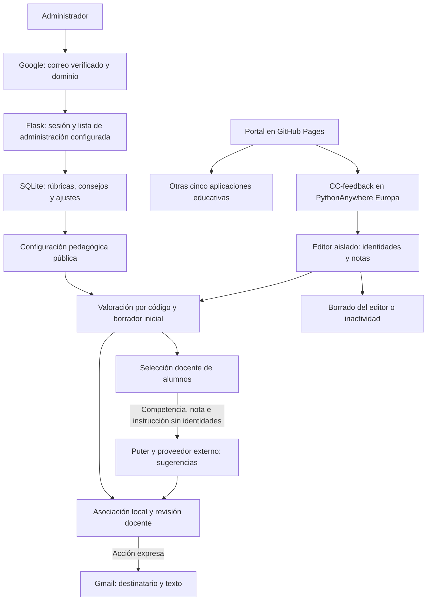

# Portal de herramientas educativas Cuatrovientos

Actualización de 10 de octubre de 2026. Catálogo público en GitHub Pages con enlaces a seis aplicaciones en PythonAnywhere Europa. CC-feedback: https://ccfeedback.eu.pythonanywhere.com/. Las mejoras recientes de su rama `puter-llm` están preparadas localmente; publicación y aceptación técnica pendientes. La migración y la inclusión en el catálogo no implican autorización institucional.

## Medidas de adecuación al RGPD

El portal no recibe notas, incorpora recursos de diseño locales y no incluye formularios, analítica ni almacenamiento de datos del alumnado. GitHub Pages puede tratar registros de IP. Cada aplicación tiene autenticación, conservación y condiciones propias; la información institucional de privacidad debe completarse y validarse. Estas medidas no constituyen una certificación de cumplimiento.

CC-feedback genera inicialmente borradores con descriptores de rúbrica seleccionados por código. Sus intervalos actuales son: nivel 1 para notas menores que 5; nivel 2 desde 5 hasta menos de 7; nivel 3 desde 7 hasta menos de 8,5; nivel 4 desde 8,5. Deben validarse estos cortes y las correspondencias entre competencias y subcompetencias. Puter mejora únicamente las sugerencias de alumnos seleccionados, una competencia por petición. Conserva las ediciones docentes, muestra el progreso y contabiliza cambios reales. La variante local permanece en `webbrowser-llm`; debe confirmarse la versión publicada.

Flask gestiona un panel administrativo con Google OAuth y SQLite para rúbricas, consejos y ajustes. Se comprueban correo verificado y dominio; ADMIN_USER restringe las cuentas si tiene valores concretos. Vacío o con asterisco permite todas las cuentas verificadas del dominio. La sesión trata identidad del administrador; los textos de configuración se distribuyen públicamente y no deben contener información personal. Las identidades y borradores permanecen en el editor aislado; al solicitar IA, las competencias y notas salen del dispositivo.

Se conservan la carga del `.env` junto a `server.py`, la restricción de archivos públicos y el sandbox/CSP del editor. La página principal adapta sus cabeceras a la ventana de autenticación de Puter. Los mapeos estáticos del despliegue requieren verificación.

El borrador inicial no conecta con Puter. Conectar carga su SDK y Acceder abre la identificación. Las peticiones de IA contienen solo competencia, nota e instrucción pedagógica; excluyen nombres, correos, total, códigos y borradores. El modelo configurado en esta revisión es `gemini-3.5-flash-lite`, modificable en `model-config.js`.

Cancelar detiene la cola y descarta resultados tardíos. No garantiza retirar una petición ya recibida por Puter ni borrar datos del proveedor. El editor retira datos al borrar, salir o tras quince minutos de inactividad; la suspensión puede retrasarlo. La limpieza de caché solo elimina `cc-feedback-model-v1`, de la variante anterior. No elimina la sesión del SDK, documentos, mensajes ni copias externas.

Puter y su proveedor realizan la inferencia externa. El alojamiento europeo de la web no determina la ubicación de esos tratamientos. Google interviene en administración y Gmail recibe texto y destinatario al abrir el borrador. La separación de identidades no acredita anonimato ni cumplimiento automático. Deben revisarse condiciones, conservación, garantías y transferencias aplicables con el DPD.

[Privacidad del portal](privacidad.html) · [Privacidad de CC-feedback](https://ccfeedback.eu.pythonanywhere.com/privacidad.html)

## Flujo de funcionamiento y datos

## Direcciones del catálogo

| Recurso | Dirección |
|---|---|
| Trasladar notas | https://trasladarnotas.eu.pythonanywhere.com/ |
| Retroalimentación de competencias clave | https://ccfeedback.eu.pythonanywhere.com/ |
| Autoevaluación de competencias clave | https://competenciasclaveauto.eu.pythonanywhere.com/ |
| Cuestionarios | https://cuestionarios4v.eu.pythonanywhere.com/acceso |
| Coevaluación de trabajos grupales | https://coevaluacionequipos.eu.pythonanywhere.com/ |
| Formador de equipos | https://formadorequipos.eu.pythonanywhere.com/ |
| Safe Exam Browser | https://safeexambrowser.org/ |

Repositorio de CC-feedback: https://github.com/cuatrovientos-ci/cc-feedback/tree/puter-llm. La dirección de producción está confirmada por el mantenedor; esta actualización documental no acredita que la última revisión esté publicada.

## Actuaciones pendientes de CC-feedback

Confirmar y comprobar el despliegue de `puter-llm`. Probar autenticación y generación real con datos ficticios, calidad, tiempos y cuotas. Configurar OAuth, clave de sesión estable y administradores; reforzar CSRF, caducidad y cookies. Validar equivalencias de rúbrica. Completar responsable, DPD, base jurídica, proveedores, conservación y autorización. La revisión debe incluir Puter y su proveedor, las garantías y posibles transferencias. Las pruebas disponibles cubren Puter simulado, carga del SDK real, cancelación local, aislamiento y Flask; no acreditan generación con cuenta real ni el despliegue público.

## Requisitos antes de usar datos reales

1. Confirmar su versión realmente desplegada y superar las comprobaciones de su guía con datos ficticios.
2. Obtener autorización del centro para finalidad, personas usuarias, campos, permisos y conservación. En Cuestionarios revisar expresamente los módulos sensibles; en Formador de equipos, el uso de perfiles y la validación humana.
3. Completar la información de privacidad de la herramienta y del portal: identidad del responsable, contacto/DPD cuando corresponda, finalidades, base jurídica, proveedores/garantías, conservación y canal de derechos. Revisar también titularidad/control de GitHub Pages y sus condiciones de alojamiento.
4. Confirmar la dirección final y su aviso de privacidad; no inventar rutas ni dar por verificados los enlaces de la tabla anterior.
5. Actualizar el estado únicamente de las herramientas autorizadas y mantener la distinción respecto a las pendientes. Configurar y verificar la conservación y el borrado, incluidas las copias externas. Mantener `rel="noopener noreferrer"` en enlaces que abran otra pestaña.
6. Revisar tutoriales para que no indiquen flujos anteriores que omitan los nuevos controles.

## Publicación y verificación

Publicar únicamente `index.html`, `privacidad.html` y `assets/` en la raíz que use GitHub Pages. El directorio contiene los archivos que deben publicarse; no se ha generado un nuevo ZIP. No contiene los repositorios de aplicaciones, bases de datos ni claves. La modificación local no actualiza el sitio público: hace falta subirla al repositorio/rama que tenga configurado Pages y comprobar el despliegue.

Vista previa local: `python -m http.server 8765 --bind 127.0.0.1`, abrir `http://127.0.0.1:8765/`. No requiere compilación ni paquetes de Node. Verificar escritorio y móvil, menú, enlaces de privacidad, estados visibles y ausencia de peticiones automáticas a dominios de terceros. Repetir la comprobación bajo la ruta de proyecto de GitHub Pages; todos los recursos del sitio tienen rutas relativas.

Fuentes del aviso: [documentación de GitHub Pages](https://docs.github.com/en/pages/getting-started-with-github-pages/what-is-github-pages) y [privacidad de GitHub](https://docs.github.com/en/site-policy/privacy-policies/github-general-privacy-statement). El código no incorpora cookies/analítica, pero GitHub documenta registros de IP por seguridad. El plazo y las garantías aplicables a la cuenta deben confirmarse; no se deducen del HTML.
