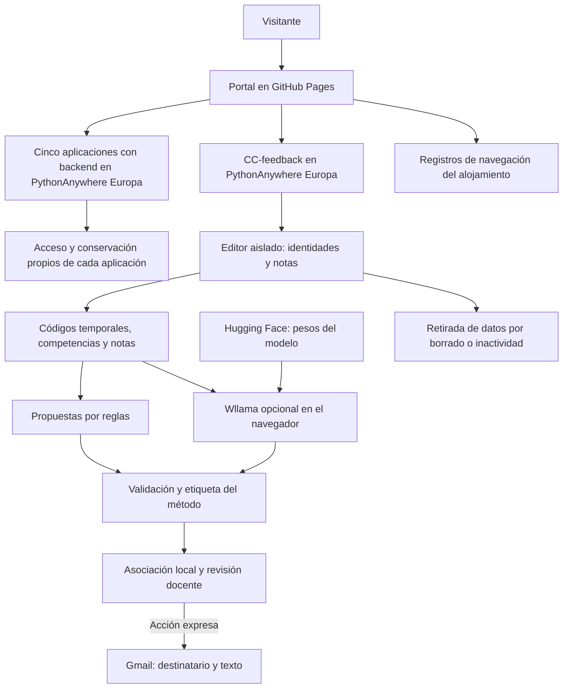

# Portal de herramientas educativas Cuatrovientos

Actualización de 10 de octubre de 2026. Catálogo público en GitHub Pages con enlaces a seis aplicaciones en PythonAnywhere Europa. CC-feedback: https://ccfeedback.eu.pythonanywhere.com/. Las mejoras recientes de su rama `webbrowser-llm` están preparadas localmente; publicación y aceptación técnica pendientes. La migración y la inclusión en el catálogo no implican autorización institucional.

## Medidas de adecuación al RGPD

El portal no recibe notas, incorpora recursos de diseño locales y no incluye formularios, analítica ni almacenamiento de datos del alumnado. GitHub Pages puede tratar registros de IP. Cada aplicación tiene autenticación, conservación y condiciones propias; la información institucional de privacidad debe completarse y validarse. Estas medidas no constituyen una certificación de cumplimiento.

CC-feedback ofrece propuestas por reglas y Wllama opcional en el navegador, con nombres, correos y total separados del motor. La revisión preparada identifica resultados por reglas, IA o mixtos, informa de sustituciones ante errores, permite cancelar y libera el motor antes de reutilizarlo. Retira los datos de sesión por borrado, salida o inactividad y verifica la limpieza de su caché propia. No borra automáticamente cachés antiguas, correos, originales ni copias externas.

La inferencia no usa una API externa de IA. El runtime se incluye en la web y el modelo Qwen 2.5 0.5B se descarga de Hugging Face desde una revisión fija. El alojamiento y las descargas generan metadatos de conexión; Gmail recibe destinatario y texto al abrir el borrador. La aplicación no impone la cuenta de Google activa. La revisión docente sigue siendo necesaria y no se deduce un nivel de rúbrica ni una conducta individual a partir de una nota.

[Privacidad del portal](privacidad.html) · [Privacidad de CC-feedback](https://ccfeedback.eu.pythonanywhere.com/privacidad.html)

## Flujo de funcionamiento y datos

## Direcciones del catálogo

| Recurso | Dirección |
|---|---|
| Trasladar notas | https://trasladarnotas.eu.pythonanywhere.com/ |
| Retroalimentación de competencias clave | https://ccfeedback.eu.pythonanywhere.com/ |
| Autoevaluación de competencias clave | https://competenciasclaveauto.eu.pythonanywhere.com/ |
| Cuestionarios | https://cuestionarios4v.eu.pythonanywhere.com/acceso |
| Coevaluación de trabajos grupales | https://coevaluacionequipos.eu.pythonanywhere.com/ |
| Formador de equipos | https://formadorequipos.eu.pythonanywhere.com/ |
| Safe Exam Browser | https://safeexambrowser.org/ |

Repositorio de CC-feedback: https://github.com/cuatrovientos-ci/cc-feedback/tree/webbrowser-llm. La dirección de producción está confirmada por el mantenedor; esta actualización documental no acredita que la última revisión esté publicada.

## Actuaciones pendientes de CC-feedback

Publicar y verificar la revisión, probar el modelo real y su calidad pedagógica en equipos del centro, comprobar la cancelación y retirada de datos, inspeccionar la red y evaluar las cabeceras para varios hilos. Completar responsable, DPD, base jurídica, conservación y derechos; revisar proveedores y licencia del modelo y obtener autorización institucional. Las pruebas automatizadas de la revisión utilizan IA simulada y no sustituyen estas comprobaciones.

## Requisitos antes de usar datos reales

1. Confirmar su versión realmente desplegada y superar las comprobaciones de su guía con datos ficticios.
2. Obtener autorización del centro para finalidad, personas usuarias, campos, permisos y conservación. En Cuestionarios revisar expresamente los módulos sensibles; en Formador de equipos, el uso de perfiles y la validación humana.
3. Completar la información de privacidad de la herramienta y del portal: identidad del responsable, contacto/DPD cuando corresponda, finalidades, base jurídica, proveedores/garantías, conservación y canal de derechos. Revisar también titularidad/control de GitHub Pages y sus condiciones de alojamiento.
4. Confirmar la dirección final y su aviso de privacidad; no inventar rutas ni dar por verificados los enlaces de la tabla anterior.
5. Actualizar el estado únicamente de las herramientas autorizadas y mantener la distinción respecto a las pendientes. Configurar y verificar la conservación y el borrado, incluidas las copias externas. Mantener `rel="noopener noreferrer"` en enlaces que abran otra pestaña.
6. Revisar tutoriales para que no indiquen flujos anteriores que omitan los nuevos controles.

## Publicación y verificación

Publicar únicamente `index.html`, `privacidad.html` y `assets/` en la raíz que use GitHub Pages. El directorio contiene los archivos que deben publicarse; no se ha generado un nuevo ZIP. No contiene los repositorios de aplicaciones, bases de datos ni claves. La modificación local no actualiza el sitio público: hace falta subirla al repositorio/rama que tenga configurado Pages y comprobar el despliegue.

Vista previa local: `python -m http.server 8765 --bind 127.0.0.1`, abrir `http://127.0.0.1:8765/`. No requiere compilación ni paquetes de Node. Verificar escritorio y móvil, menú, enlaces de privacidad, estados visibles y ausencia de peticiones automáticas a dominios de terceros. Repetir la comprobación bajo la ruta de proyecto de GitHub Pages; todos los recursos del sitio tienen rutas relativas.

Fuentes del aviso: [documentación de GitHub Pages](https://docs.github.com/en/pages/getting-started-with-github-pages/what-is-github-pages) y [privacidad de GitHub](https://docs.github.com/en/site-policy/privacy-policies/github-general-privacy-statement). El código no incorpora cookies/analítica, pero GitHub documenta registros de IP por seguridad. El plazo y las garantías aplicables a la cuenta deben confirmarse; no se deducen del HTML.
