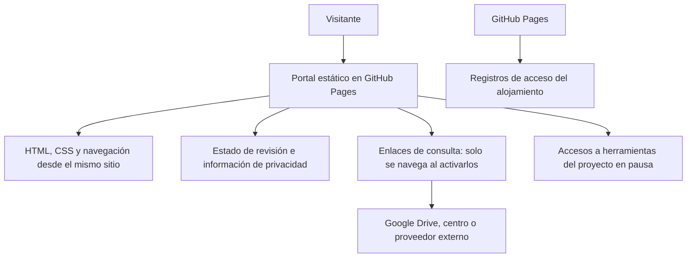

# Portal de herramientas educativas Cuatrovientos

Portal estático para GitHub Pages. Revisión local: 7 de octubre de 2026. No se ha publicado esta actualización ni cambiado la configuración de GitHub o PythonAnywhere.

## Cambios

- Bootstrap 5.3.8 se sirve localmente, con su licencia MIT en `assets/vendor/bootstrap/LICENSE`. Se han quitado únicamente las referencias a mapas de código no distribuidos. No se cargan recursos desde jsDelivr, fuentes remotas ni vídeos incrustados.
- Metadatos `Referrer-Policy: no-referrer` y política de contenido mediante etiquetas HTML, con recursos del propio sitio y sin conexiones de datos, objetos ni formularios. La etiqueta CSP no sustituye todas las cabeceras de servidor; por ejemplo, `frame-ancestors` necesita cabecera HTTP y no se añade como meta. No se presume que GitHub Pages permita configurar cabeceras arbitrarias.
- Aviso visible de revisión y accesos en pausa como texto, sin un enlace activo oculto detrás de un botón deshabilitado. Funciona también sin JavaScript. El menú móvil sigue usando Bootstrap local.
- Página `privacidad.html`: funcionamiento real del portal, alojamiento GitHub Pages, enlaces externos y campos institucionales pendientes. No es una política definitiva aprobada. No se ha inventado la identidad del responsable, contacto, base jurídica ni plazos.
- Se conservan autoría, créditos y tutoriales. Se advierte que el material puede corresponder a versiones antiguas y que un documento de referencia no prueba autorización vigente.

## Estado de los recursos

| Recurso | Estado del portal | Dirección anterior, para comprobación antes de una futura habilitación |
|---|---|---|
| Trasladar notas | Actualización y autorización pendientes | https://trasladarnotas.pythonanywhere.com/ |
| Retroalimentación de competencias clave | Pendiente de revisión específica; acceso en pausa | https://cuatrovientos-ci.github.io/cc-feedback/ |
| Autoevaluación de competencias clave | Actualización y autorización pendientes | https://competenciasclaveauto.pythonanywhere.com/acceso |
| Cuestionarios | Actualización y autorización pendientes | https://autopercepcion.pythonanywhere.com/acceso |
| Coevaluación de trabajos grupales | Actualización y autorización pendientes | https://coevaluacionequipos.pythonanywhere.com/ |
| Formador de equipos | Actualización y autorización pendientes | https://formadorequipos.pythonanywhere.com/teacher |
| Safe Exam Browser | Recurso externo, fuera de la revisión; enlace a su proveedor | https://safeexambrowser.org/ |

Las cinco aplicaciones revisadas tienen cambios preparados en sus repositorios locales. No se ha acreditado que estén desplegados ni autorizados. No extender ese resultado a Retroalimentación o Safe Exam Browser. El enlace al proveedor externo no equivale a recomendar su instalación ni a autorizar exámenes con él.

**La pausa del catálogo no desactiva las aplicaciones.** Si el centro mantiene su pausa de uso, TI debe aplicar los controles correspondientes en cada despliegue. No se ha entrado en esos servicios ni alterado su estado.

## Flujo

## Requisitos antes de habilitar una herramienta

1. Confirmar su versión realmente desplegada y superar las comprobaciones de su guía con datos ficticios.
2. Obtener autorización del centro para finalidad, personas usuarias, campos, permisos y conservación. En Cuestionarios revisar expresamente los módulos sensibles; en Formador de equipos, el uso de perfiles y la validación humana.
3. Completar la información de privacidad de la herramienta y del portal: identidad del responsable, contacto/DPD cuando corresponda, finalidades, base jurídica, proveedores/garantías, conservación y canal de derechos. Revisar también titularidad/control de GitHub Pages y sus condiciones de alojamiento.
4. Confirmar la dirección final y su aviso de privacidad; no inventar rutas ni dar por verificados los enlaces de la tabla anterior.
5. Sustituir solo el `span.access-paused` de la herramienta autorizada por su enlace y actualizar su estado, el aviso global y la fecha. Mantener `rel="noopener noreferrer"` en enlaces que abran otra pestaña. Comprobar que no se sugiera aprobación de las restantes.
6. Revisar tutoriales para que no indiquen flujos anteriores que omitan los nuevos controles.

## Publicación y verificación

Publicar únicamente `index.html`, `privacidad.html` y `assets/` en la raíz que use GitHub Pages. Se prepara `dist/portal-github-pages.zip` con esos archivos. No contiene los repositorios de aplicaciones, bases de datos ni claves. La modificación local no actualiza el sitio público: hace falta subirla al repositorio/rama que tenga configurado Pages y comprobar el despliegue.

Vista previa local: `python -m http.server 8765 --bind 127.0.0.1`, abrir `http://127.0.0.1:8765/`. No requiere compilación ni paquetes de Node. Verificar escritorio y móvil, menú, enlaces de privacidad, estados visibles y ausencia de peticiones automáticas a dominios de terceros. Repetir la comprobación bajo la ruta de proyecto de GitHub Pages; todos los recursos del sitio tienen rutas relativas.

Fuentes del aviso: [documentación de GitHub Pages](https://docs.github.com/en/pages/getting-started-with-github-pages/what-is-github-pages) y [privacidad de GitHub](https://docs.github.com/en/site-policy/privacy-policies/github-general-privacy-statement). El código no incorpora cookies/analítica, pero GitHub documenta registros de IP por seguridad. El plazo y las garantías aplicables a la cuenta deben confirmarse; no se deducen del HTML.
