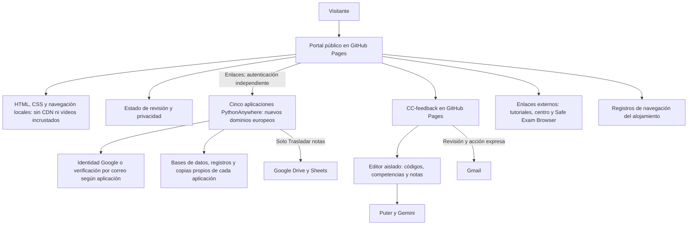

# Portal de herramientas educativas Cuatrovientos

Portal estático para GitHub Pages. Actualización: 8 de octubre de 2026. Enlaces a los nuevos dominios europeos de PythonAnywhere y referencia a las medidas de adecuación al RGPD. La migración está en curso; no se presupone su finalización ni la autorización institucional.

## Adecuación al RGPD

Documentación revisada el 9 de octubre de 2026 a partir de los diagramas del informe inicial y del código actual. Describe las medidas implementadas; la configuración y autorización de producción deben comprobarse aparte.

El portal incorpora recursos de diseño locales, política de contenido y ausencia de formularios, analítica y almacenamiento de calificaciones en su propio código. GitHub Pages puede tratar datos de navegación, incluidos registros de IP. Los enlaces no unifican la autenticación ni autorizan el uso de las aplicaciones con datos reales. La información institucional de privacidad y las condiciones del alojamiento deben completarse y validarse. La referencia a medidas de adecuación al RGPD no constituye una certificación de cumplimiento.

El aviso se mantiene en `privacidad.html`; GitHub Pages no carga variables de un archivo `.env`.

[Guía de privacidad](privacidad.html) · [Web](https://anderfrago.github.io/herramientas-educativas-cuatrovientos/).

## Flujo de funcionamiento y datos

## Cambios

- Bootstrap 5.3.8 se sirve localmente, con su licencia MIT en `assets/vendor/bootstrap/LICENSE`. Se han quitado únicamente las referencias a mapas de código no distribuidos. No se cargan recursos desde jsDelivr, fuentes remotas ni vídeos incrustados.
- Metadatos `Referrer-Policy: no-referrer` y política de contenido mediante etiquetas HTML, con recursos del propio sitio y sin conexiones de datos, objetos ni formularios. La etiqueta CSP no sustituye todas las cabeceras de servidor; por ejemplo, `frame-ancestors` necesita cabecera HTTP y no se añade como meta. No se presume que GitHub Pages permita configurar cabeceras arbitrarias.
- Enlaces activos para revisión y pruebas con datos ficticios, con aviso visible de autorización institucional pendiente. Funcionan también sin JavaScript. El menú móvil sigue usando Bootstrap local.
- Página `privacidad.html`: funcionamiento real del portal, alojamiento GitHub Pages, enlaces externos y campos institucionales pendientes. No es una política definitiva aprobada. No se ha inventado la identidad del responsable, contacto, base jurídica ni plazos.
- Se conservan autoría, créditos y tutoriales. Se advierte que el material puede corresponder a versiones antiguas y que un documento de referencia no prueba autorización vigente.

## Estado de los recursos

| Recurso | Dirección para revisión |
|---|---|
| Trasladar notas | https://trasladarnotas.eu.pythonanywhere.com/ |
| Retroalimentación de competencias clave | https://cuatrovientos-ci.github.io/cc-feedback/ |
| Autoevaluación de competencias clave | https://competenciasclaveauto.eu.pythonanywhere.com/ |
| Cuestionarios | https://cuestionarios4v.eu.pythonanywhere.com/acceso |
| Coevaluación de trabajos grupales | https://coevaluacionequipos.eu.pythonanywhere.com/ |
| Formador de equipos | https://formadorequipos.eu.pythonanywhere.com/ |
| Safe Exam Browser | https://safeexambrowser.org/ |

Las seis aplicaciones incorporan medidas técnicas de adecuación al RGPD. Su presencia en el catálogo no acredita cumplimiento completo ni autoriza el uso con datos reales. La migración de las cinco aplicaciones de PythonAnywhere está en curso; el portal y CC-feedback permanecen en GitHub Pages. Safe Exam Browser queda fuera de esta revisión.

## Requisitos antes de usar datos reales

1. Confirmar su versión realmente desplegada y superar las comprobaciones de su guía con datos ficticios.
2. Obtener autorización del centro para finalidad, personas usuarias, campos, permisos y conservación. En Cuestionarios revisar expresamente los módulos sensibles; en Formador de equipos, el uso de perfiles y la validación humana.
3. Completar la información de privacidad de la herramienta y del portal: identidad del responsable, contacto/DPD cuando corresponda, finalidades, base jurídica, proveedores/garantías, conservación y canal de derechos. Revisar también titularidad/control de GitHub Pages y sus condiciones de alojamiento.
4. Confirmar la dirección final y su aviso de privacidad; no inventar rutas ni dar por verificados los enlaces de la tabla anterior.
5. Actualizar el estado únicamente de las herramientas autorizadas y mantener la distinción respecto a las pendientes. Configurar y verificar la conservación y el borrado, incluidas las copias externas. Mantener `rel="noopener noreferrer"` en enlaces que abran otra pestaña.
6. Revisar tutoriales para que no indiquen flujos anteriores que omitan los nuevos controles.

## Publicación y verificación

Publicar únicamente `index.html`, `privacidad.html` y `assets/` en la raíz que use GitHub Pages. Se prepara `dist/portal-github-pages.zip` con esos archivos. No contiene los repositorios de aplicaciones, bases de datos ni claves. La modificación local no actualiza el sitio público: hace falta subirla al repositorio/rama que tenga configurado Pages y comprobar el despliegue.

Vista previa local: `python -m http.server 8765 --bind 127.0.0.1`, abrir `http://127.0.0.1:8765/`. No requiere compilación ni paquetes de Node. Verificar escritorio y móvil, menú, enlaces de privacidad, estados visibles y ausencia de peticiones automáticas a dominios de terceros. Repetir la comprobación bajo la ruta de proyecto de GitHub Pages; todos los recursos del sitio tienen rutas relativas.

Fuentes del aviso: [documentación de GitHub Pages](https://docs.github.com/en/pages/getting-started-with-github-pages/what-is-github-pages) y [privacidad de GitHub](https://docs.github.com/en/site-policy/privacy-policies/github-general-privacy-statement). El código no incorpora cookies/analítica, pero GitHub documenta registros de IP por seguridad. El plazo y las garantías aplicables a la cuenta deben confirmarse; no se deducen del HTML.
